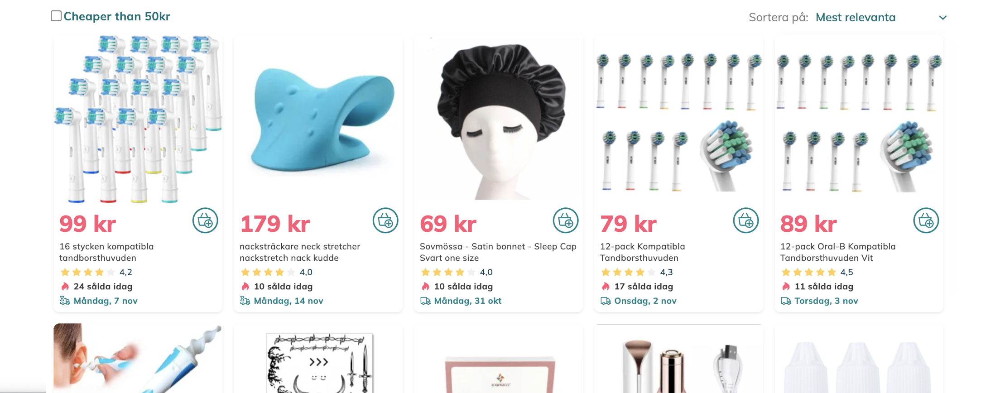
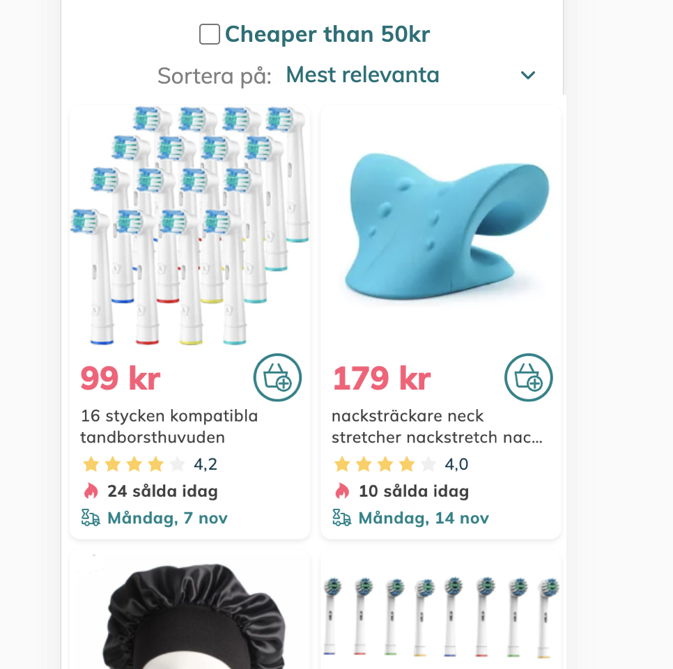

# Fyndiq Test Starter Kit ✨

This project was bootstrapped with [Create React App](https://github.com/facebook/create-react-app).

**The purpose** of this repo is to provide you with a pre-configured repo to save time.

## Available scripts 🧑🏾‍💻

We recommend using `yarn`, but if you prefer, go ahead with `npm`. Remember to use the current LTS node version!

Instructions:

```
yarn
yarn start
```

or

```
npm install
npm start
```

The app will run in development mode at [http://localhost:8080](http://localhost:8080). The page will reload if you make edits and you will also see lint errors in the console.

## Test assignment 🛠

Our designers 🦸🏽 have created a new page for our articles, and your job is to build it using React. Here are the designs:

### Desktop version



### Mobile version



### Your main task is:

1. Fetch the product articles from our API described below.
1. Display them in a responsive grid as in the designs above
1. Show only articles that cost less than 50 kr if the filter `Cheaper than 50kr` is checked.

### And if you have time:

- Add the sorting functionality `by price` and `by rating`, in ascending and descending orders. `Mest relevanta` (`Most relevant` in Swedish) is the only sorting option provided by the API.
- The sorting and filtering **must** work together.

### Resources & Requirements:

- The API endpoint you'll be using to fetch articles: `https://shop-bff.fyndiq.se/code-assignment/articles`

  - **Note:** You will need to supply two headers for the request to succeed: `market` with a value of `SE` and `locale` with a value of `sv-SE`.

- All assets (like the truck and star icons) can be found here: https://fyndiq.se/halsa-skonhet/. Feel free to inspect the styles on our website and use anything from there.

- On the live site, you will find additional functionality (quick add button, different badges, etc). **You don't need to implement those**. Focus on the designs from the screenshots.

- Use any font you like. You can download one from https://fonts.google.com/.

- You can use any technology you like for styling.

- Please, version control your code with `git`.

- Try and implement as much as you can in **2−3 hours**, and remember that **you do not need to finish the entire assignment**. So if time is running out, use good judgment and skip anything that is not essential for delivering something you are satisfied with.

### Consider the following topics for evaluation

- Code quality and readability
- Responsiveness
- Semantics

### Best of luck! 🤞 Don't forget to push your commits and send us a link to a repo somewhere with your assignment. A zip is fine too though. 😉
